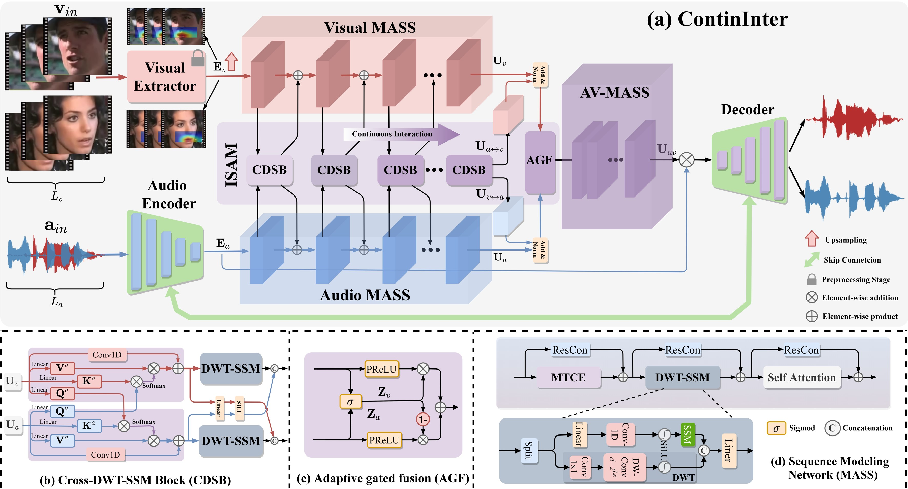
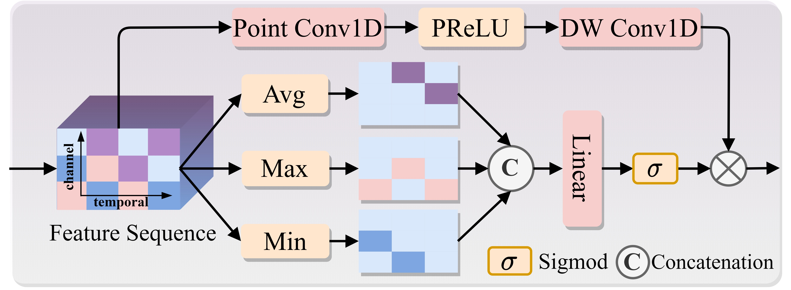

<div align="center">

# CONTININTER

### State-Space and Attention-Aware Audio-Visual Continuous Interaction Modeling for Efficient Speech Separation

**Debang Liu<sup>†</sup>, Tianqi Zhang, Chen Yi, and Ying Wei**

School of Communications and Information Engineering  
Chongqing University of Posts and Telecommunications, Chongqing, China

[Our Method](#our-method) • [Code Availability](#code-availability) • [Demo](#demo) • [Network Architecture](#network-architecture) • [Results](#results) • [Citation](#citation)

</div>

---

## Our Method

We propose **ContinInter**, an efficient audio-visual speech separation framework that continuously exploits complementary audio and visual information throughout multi-resolution sequence modeling.

ContinInter comprises two core components: the **Interactive State-Aware Model (ISAM)** and **Multi-Scale Attentive State-Space Sequence Modeling (MASS)**. ISAM combines cross-attention with convolutional state-space modeling to enable continuous cross-modal interaction across network layers. MASS integrates temporal-channel enhancement, parallel temporal convolution and state-space branches, and self-attention to jointly capture local dynamics, long-range dependencies, and global context.

Experiments on GRID-Mix, LRS2-Mix, and LRS3-Mix demonstrate a favorable balance between separation performance, model size, computational cost, and training memory consumption.

---

## Code Availability

The source code will be released soon.

---

## Demo

The following video demonstrates the effectiveness of ContinInter for speech separation on selected real-world recordings.

https://github.com/user-attachments/assets/bf8b7764-7fbd-4866-8d99-ea22ac9cfd66

---

## Network Architecture

### Main Framework

ContinInter adopts a multi-scale encoder-decoder architecture for time-domain audio-visual speech separation. Separate MASS branches first enhance the contextual representations of the encoded audio and visual features. ISAM then enables continuous cross-modal interaction across resolutions and network layers. Following adaptive gated fusion, an audio-visual MASS branch further refines the fused representation for mask estimation and waveform reconstruction.

<p align="center">
  
</p>

<p align="center">
  <em>Overall architecture of ContinInter.</em>
</p>

### Interactive State-Aware Model

The **Interactive State-Aware Model (ISAM)** comprises stacked **Cross-Modal Dynamic State Blocks (CDSBs)** followed by **Adaptive Gated Fusion (AGF)**.

Within each CDSB, cross-attention establishes associations between audio and visual features, while convolutional state-space modeling captures temporal dependencies in the attended representations. Repeating these operations across layers progressively refines both streams, allowing complementary cross-modal information to inform sequence modeling throughout the network. AGF then adaptively weights and combines the resulting audio and visual representations.

### Multi-Scale Attentive State-Space Sequence Modeling

**Multi-Scale Attentive State-Space Sequence Modeling (MASS)** integrates temporal-channel enhancement, parallel temporal convolution and selective state-space branches, self-attention, and residual connections.

Temporal-channel enhancement enriches feature representations, while the parallel branches capture local temporal structure and long-range dependencies. Self-attention further models global contextual relationships. Together, these operations support complementary sequence modeling across multiple temporal scales.

<p align="center">
  
</p>

---

## Results

We evaluate ContinInter on three audio-visual speech separation benchmarks: **GRID-Mix**, **LRS2-Mix**, and **LRS3-Mix**.

ContinInter achieves competitive separation performance with a compact architecture and low computational cost. The experimental comparisons also demonstrate reduced training memory consumption, supporting a favorable balance between separation quality and resource requirements.

### Lip Embedding Visualization

The following figure visualizes lip embeddings from the evaluation datasets.

<p align="center">
  
</p>

<p align="center">
  <em>Visualization of lip embeddings across datasets.</em>
</p>

### Spectrogram Visualization

The following figure provides a qualitative comparison of speech separation results through spectrogram visualization.

<p align="center">
  
</p>

<p align="center">
  <em>Spectrogram visualization of speech separation results.</em>
</p>

---

## Citation

If you find ContinInter useful for your research, please cite our work:

```bibtex
@misc{liu2026contininter,
  title  = {ContinInter: State-Space and Attention-Aware Audio-Visual
            Continuous Interaction Modeling for Efficient Speech Separation},
  author = {Liu, Debang and Zhang, Tianqi and Yi, Chen and Wei, Ying},
  year   = {2026},
  note   = {Manuscript}
}
```

The citation information will be updated after publication.

---

<div align="center">

If you find this project useful, please consider giving it a ⭐.

</div>
